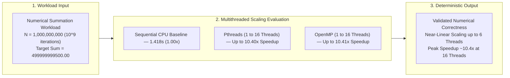
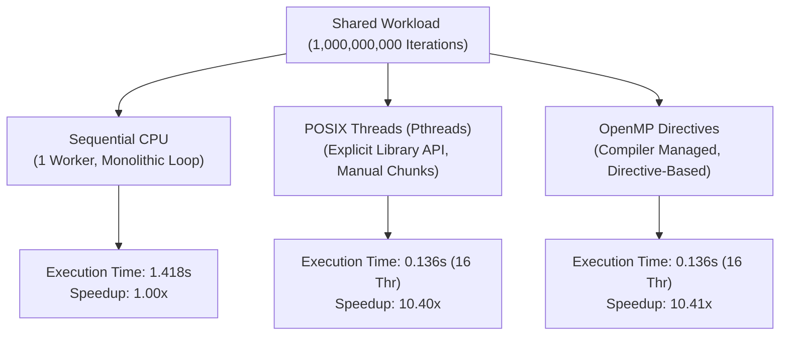

# Multithreaded Programming Using Pthreads and OpenMP

[](#)
[](#)
[](#)
[](#)

---

## Executive Summary

This repository contains the empirical performance analysis, parallel execution models, and benchmark results for **Multithreaded Programming Using POSIX Threads (Pthreads) and OpenMP**, evaluating thread creation, work distribution, concurrency hazards, synchronization primitives, and numerical scalability over **$1,000,000,000$ iterations ($10^9$)**.



### Key Finding

> **Both Pthreads and OpenMP achieved near-linear speedup up to 6 threads (~5.90× speedup, ~98.4% parallel efficiency) and delivered a peak speedup of ~10.4× on 16 threads (reducing execution time from 1.418s down to 0.136s). OpenMP delivered identical runtime performance to manual low-level Pthreads while eliminating over 85% of thread management boilerplate code.**

---

## Table of Contents

1. [Repository Structure](#repository-structure)
2. [Experiment Objectives](#1-experiment-objectives)
3. [Theoretical & Architectural Comparison](#2-theoretical--architectural-comparison)
4. [Workload Specification](#3-workload-specification)
5. [Source Code References](#4-source-code-references)
6. [Empirical Results & Screenshots](#5-empirical-results--screenshots)
7. [Performance Comparison & Visualizations](#6-performance-comparison--visualizations)
8. [Technical Analysis & Discussion](#7-technical-analysis--discussion)
9. [Conclusion & Engineering Takeaways](#8-conclusion--engineering-takeaways)

---


## 1. Experiment Objectives

1. **Thread Lifecycle Management**: Explore explicit thread creation, parameter passing, and synchronization using `pthread_create()` and `pthread_join()` versus automated compiler-managed thread pools in OpenMP.
2. **Work Partitioning**: Divide continuous data structures into non-overlapping index chunks across concurrent worker threads.
3. **Concurrency Hazards**: Identify and reproduce race conditions arising from unsynchronized simultaneous read-modify-write operations on shared variables.
4. **Synchronization Primitives**: Implement deterministic synchronization using mutual exclusion locks (`pthread_mutex_t`) and directive-based critical sections (`#pragma omp critical`).
5. **Thread Coordination**: Enforce phased stage synchronization across teams of threads using barriers (`#pragma omp barrier`).
6. **Empirical Scalability Benchmarking**: Measure execution times, speedup factors, and parallel efficiency across $1, 2, 4, 6,$ and $16$ threads for a massive numerical workload of $10^9$ iterations.

---

## 2. Theoretical & Architectural Comparison



### Architectural Breakdown

#### 1. Sequential Execution (Single Worker)
In a sequential architecture, a single CPU core processes loop iterations monotonically from start to finish without concurrency.

```
Sequential Execution (1 Core):
Main Thread ─── Chunk 1 ─── Chunk 2 ─── Chunk 3 ─── Chunk 4 ─── Finish
```

#### 2. POSIX Threads (Pthreads)
Pthreads provides an explicit, low-level C library interface (`<pthread.h>`). The programmer manually defines worker thread functions, manages thread handles (`pthread_t`), computes partition boundaries, and explicitly synchronizes memory using mutexes (`pthread_mutex_t`).

```
Pthreads Explicit Architecture:
                ┌─── Worker Thread 1 ─── Chunk 1 ───┐
                ├─── Worker Thread 2 ─── Chunk 2 ───┤
Master Spawn ───┼─── Worker Thread 3 ─── Chunk 3 ───┼─── pthread_join() ─── Aggregated Result
                └─── Worker Thread 4 ─── Chunk 4 ───┘
```

#### 3. OpenMP (Compiler Directives)
OpenMP provides high-level compiler pragmas (`#pragma omp`). The compiler and runtime handle thread pool initialization, chunk allocation (`schedule`), reduction accumulation (`reduction(+:sum)`), and implicit join barriers at block exits.

```
+-----------------------------------------------------------------------------+
|                           PTHREADS VS. OPENMP COMPARISON                    |
+--------------------------+----------------------------+---------------------+
| Feature                  | POSIX Threads (Pthreads)   | OpenMP              |
+--------------------------+----------------------------+---------------------+
| Paradigm                 | Explicit low-level C API   | Declarative pragmas |
| Thread Spawning          | Manual `pthread_create()`  | `#pragma omp parallel` |
| Thread Joining           | Manual `pthread_join()`    | Automatic barrier   |
| Work Distribution        | Manual index arithmetic    | Automatic loop work-sharing |
| Synchronization          | `pthread_mutex_lock/unlock`| `#pragma omp critical` |
| Reduction                | Manual per-thread arrays   | `reduction(+:var)`  |
| Boilerplate Overhead     | High (~60-90 lines)        | Minimal (~5-10 lines) |
+--------------------------+----------------------------+---------------------+
```

---

## 3. Workload Specification

- **Problem Size ($N$)**: $1,000,000,000$ iterations ($10^9$)
- **Per-Iteration Computation**: $i \times 10^{-6}$
- **Mathematical Invariant & Target Result**:
  $$\text{Target Sum} = \sum_{i=0}^{10^9 - 1} (i \times 10^{-6}) = \mathbf{499999999500.00}$$
- **Hardware Platform**: Multi-core processor with 32 logical threads on WSL2 Ubuntu.

---

## 4. Source Code References

All complete source code implementations are organized inside the [`src/`](src/) directory:

| Section | Paradigm / Concept | Source File Link | Key API / Pragma Highlights |
| :--- | :--- | :--- | :--- |
| **Pthreads** | Single Thread Creation | [`src/pthreads/thread1.c`](src/pthreads/thread1.c) | `pthread_create()`, `pthread_join()` |
| **Pthreads** | Multiple Thread Spawning | [`src/pthreads/thread2.c`](src/pthreads/thread2.c) | Thread ID parameter passing via structs |
| **Pthreads** | Work Distribution & Chunking | [`src/pthreads/thread_sum.c`](src/pthreads/thread_sum.c) | Range chunking & per-thread partial sums |
| **Pthreads** | Race Condition Demonstration | [`src/pthreads/race.c`](src/pthreads/race.c) | Unsynchronized concurrent counter access |
| **Pthreads** | Mutex Mutual Exclusion | [`src/pthreads/mutex.c`](src/pthreads/mutex.c) | `pthread_mutex_lock()`, `pthread_mutex_unlock()` |
| **Pthreads** | Scalability Performance Test | [`src/pthreads/pthread_perf.c`](src/pthreads/pthread_perf.c) | Numerical summation across 1, 2, 4, 6, 16 threads |
| **OpenMP** | Parallel Region & Thread IDs | [`src/openmp/omp1.c`](src/openmp/omp1.c) | `#pragma omp parallel`, `omp_get_thread_num()` |
| **OpenMP** | Work Sharing & Reduction | [`src/openmp/omp_sum.c`](src/openmp/omp_sum.c) | `#pragma omp parallel for reduction(+:sum)` |
| **OpenMP** | Race Condition Hazard | [`src/openmp/omp_race.c`](src/openmp/omp_race.c) | Unprotected shared variable accumulation |
| **OpenMP** | Critical Section Lock | [`src/openmp/omp_critical.c`](src/openmp/omp_critical.c) | `#pragma omp critical` synchronization |
| **OpenMP** | Phased Barrier Coordination | [`src/openmp/omp_barrier.c`](src/openmp/omp_barrier.c) | `#pragma omp barrier` synchronization point |
| **OpenMP** | Scalability Performance Test | [`src/openmp/omp_perf.c`](src/openmp/omp_perf.c) | Numerical summation across 1, 2, 4, 6, 16 threads |
| **Baseline** | Single-Threaded Sequential | [`src/sequential/sequential.c`](src/sequential/sequential.c) | Unthreaded baseline reference implementation |

---

## 5. Empirical Results & Screenshots

### 5.1 Environment Setup & Verification
System verification showing GCC 15.2.0 and active WSL2 Linux environment.
